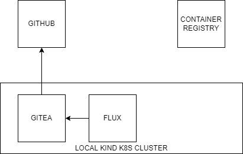
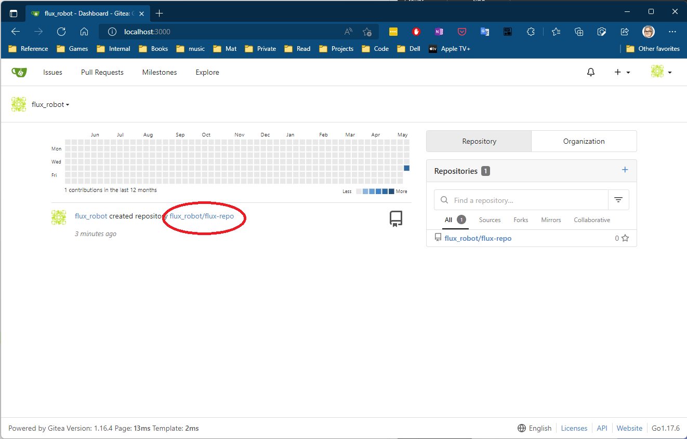
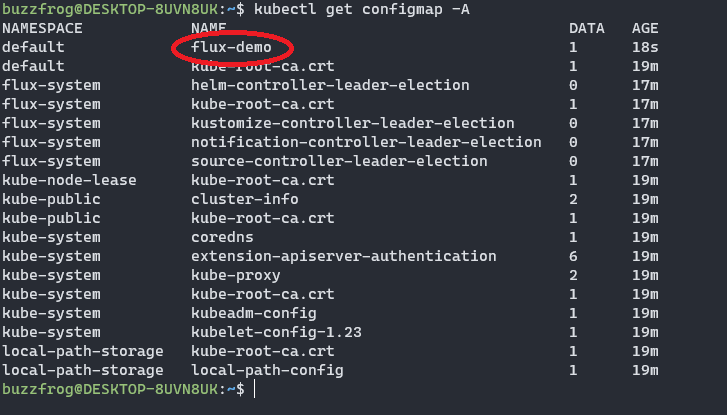

# ocw-airgap
OCW - Enabling air-gapped container deployment in digital factories

## Required Tools
* Docker Desktop
* Kind
* Kubectl
* Flux
* (Optional) k9s (To debug)

## Architecture

## Installing 

1. Clone this repo

2. Create a new kind cluster
```
kind create cluster
```
3. Execute `deploy-local.sh <your-gitea-password>`

4. Connect to Gitea in the cluster
```
kubectl port-forward svc/gitea-http 3000
```

5. Browse to `localhost:3000`

6. Sign in with username: flux_robot and your password

7. Click on the link encircled in red, shown on the image below.

> Why? This link has the correct url, the other on the right side have a pregenerated url.

8. Upload the configmap.yml file and commit it to the repo

9. Verify that this configMap is created in the cluster (it can take up to one minute)
```
kubectl get configmap -A
```
